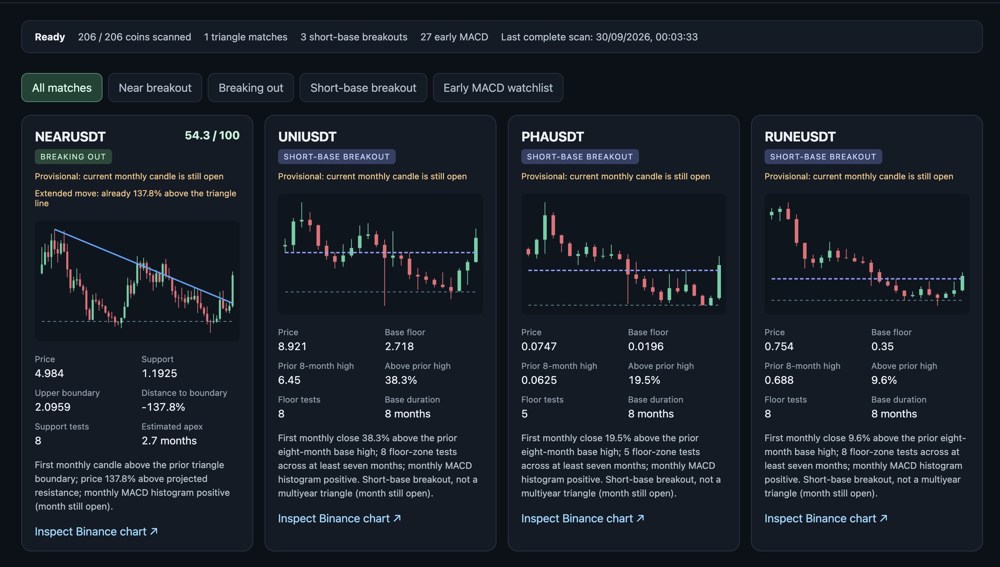
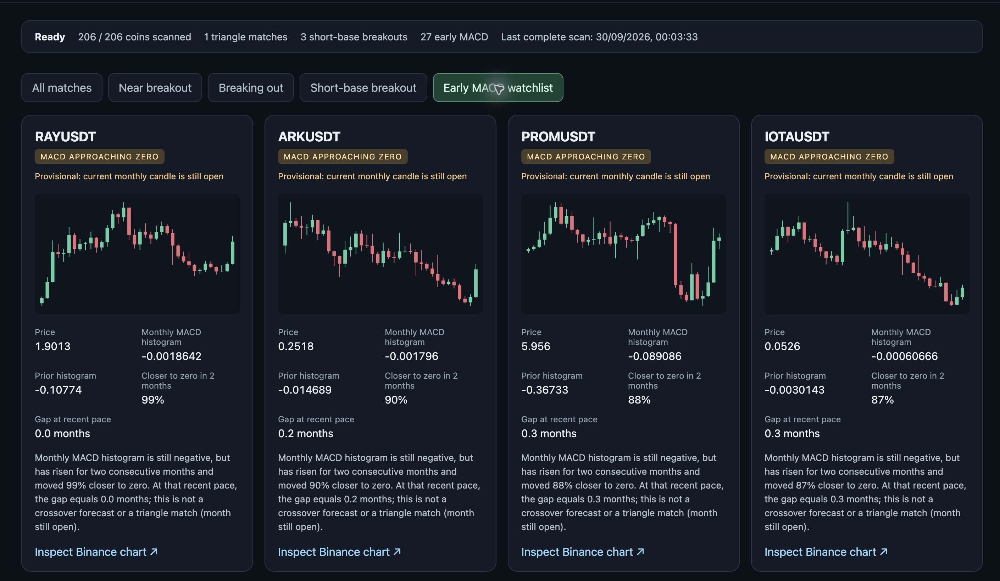

# Triangle Watch


A local, read-only scanner for Binance USDT spot coins approaching the decision
point of a descending triangle while the **monthly MACD histogram has recently
turned positive**. It also labels shorter flat-base breakouts separately. An
early MACD watchlist shows coins whose histogram is still negative but rising
toward zero. It uses monthly price and volume candles, not screenshots.

## Screenshots

These show a scan from 30 September 2026. Prices and matches change as the
monthly candles update.

**Pattern results:** NEAR's triangle breakout appears alongside shorter base
breakouts, including PHA.



**Early MACD watchlist:** coins whose monthly MACD histogram is still negative
but rising toward zero.



## Run

```sh
python3 app.py
```

Open [http://127.0.0.1:8765](http://127.0.0.1:8765). The first scan starts
automatically and repeats every two hours. Select **Enable browser alerts** to
get notifications while the dashboard is open. No exchange account, API key,
or third-party package is required.

Optional settings:

```sh
MAX_SYMBOLS=100 SCAN_INTERVAL_SECONDS=3600 PORT=8765 python3 app.py
```

## Current rule

- Take active Binance USDT spot pairs with at least USDT 1m of reported
  24-hour turnover. The default cap of 1,000 pairs covers all such pairs at
  the time of writing.
- Examine 24–60 monthly candles. Require support-zone tests spanning at least
  18 months, lower swing highs, and a falling upper boundary with an estimated apex
  no more than eight months away. The current price must be within 25% below
  or 10% above that boundary.
- Require the standard 12/26/9 monthly MACD histogram to be positive now and
  negative or zero within the preceding three candles.
- Label a coin **near breakout** while it is approaching the upper boundary.
  Freeze that boundary at the previous month's close; if the next monthly
  candle trades at least 1% above it, label that first candle **breaking out**
  even if the move is already large. An open monthly candle is marked
  **provisional**.
- Label a coin **short-base breakout** when its first monthly close is at
  least 5% above the preceding eight months' high, after an eight-month floor
  with at least three tests spanning seven months. Require an earlier high at
  least twice that base high and a recently positive monthly MACD histogram.
  This category does **not** imply a multiyear descending triangle.
- Put a coin in **Early MACD watchlist** when the last three monthly histogram
  readings are negative and each is higher than the preceding reading, the
  latest reading is at least 25% closer to zero than two months earlier, and
  the remaining gap is at most three months of the recent two-month pace.
  This is a momentum watch only: it does not require a triangle and does not
  predict when a crossover will occur. A coin already listed as a triangle
  match is not duplicated here.

The matching thresholds are starting values. They have not been validated for
profitability. A chart match should be inspected before acting. The app makes
no trades. The local dashboard's browser notifications work only while its tab
is open. The fit score ranks pattern similarity; it is not a forecast or a
probability of profit.

The included NEARUSDT August and September 2026 candle snapshots are regression
examples: August is **near breakout** and September is **breaking out**. The
FETUSDT September 2026 snapshot is an **early MACD watch** without a triangle
match. The PHAUSDT September snapshot is a **short-base breakout**, not a
multiyear triangle. These examples are not a backtest of returns.
