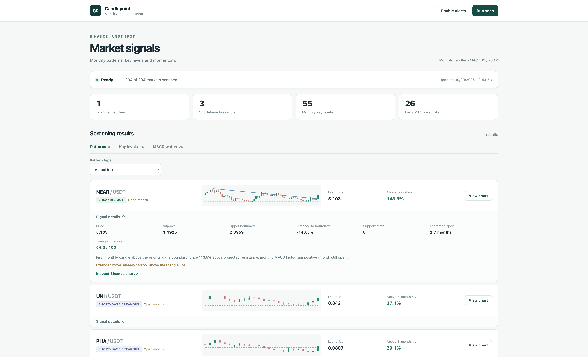
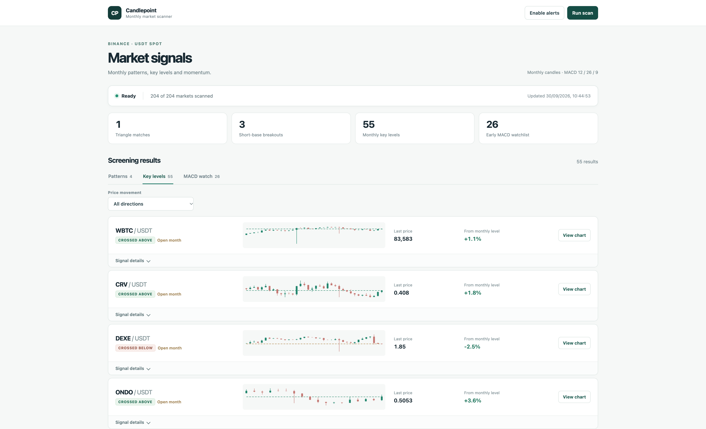
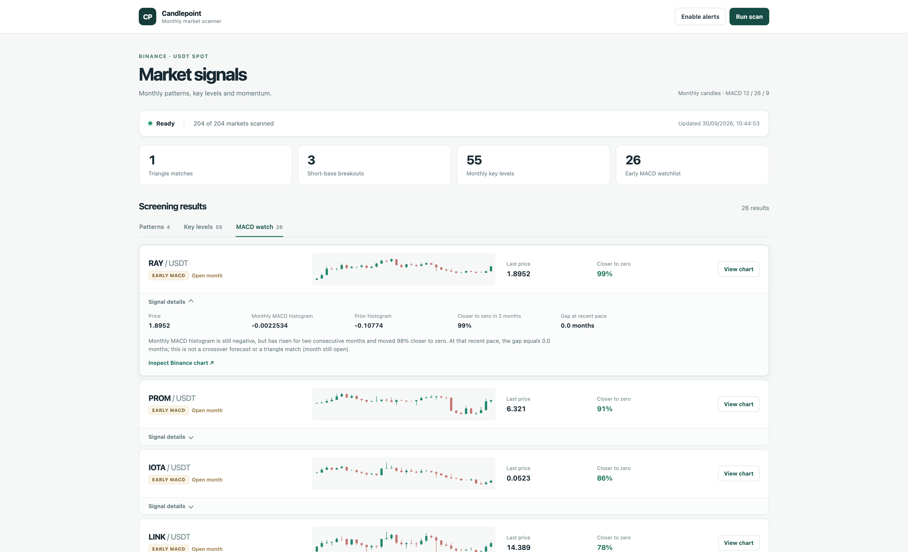
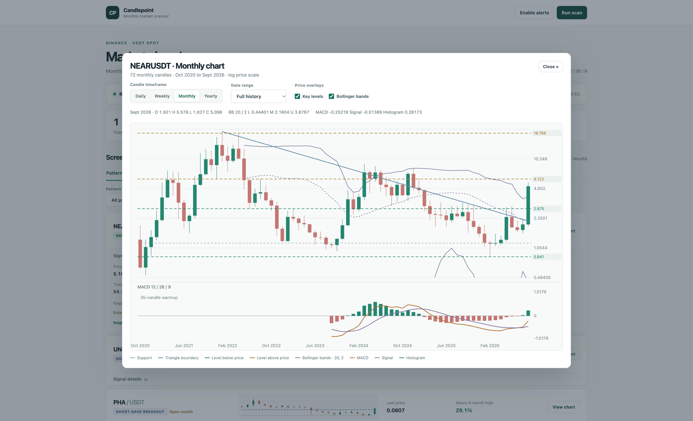

# Candlepoint

[](https://github.com/tomosjohnrees/candlepoint/actions/workflows/ci.yml)

Candlepoint is a local, read-only market scanner for Binance USDT and BTC spot pairs. It screens USDT pairs for monthly chart patterns, significant price levels, improving MACD momentum, and hourly MACD/RSI extremes. BTC pairs get separate weekly MACD and Bollinger Band signals. It presents the results in a browser dashboard with charts and the data behind each signal. It does not connect to an exchange account or place trades.



## What the dashboard shows

| View | Signals |
| --- | --- |
| **Patterns** | Multiyear descending triangles approaching or crossing their upper boundary, plus shorter base breakouts above the prior eight-month high. A pattern-type dropdown narrows the results. |
| **Key levels** | Assets moving toward a monthly swing level or crossing it in either direction. A price-movement dropdown filters approaches and upward or downward crosses. |
| **MACD watch** | Assets whose monthly MACD histogram remains negative but has risen for two consecutive months toward zero. This is a momentum watchlist, not a predicted crossover. |
| **1-hour extremes** | Assets with 1-hour RSI at least 80 and a positive MACD line in the top 5% of its previous 180 hourly readings, or RSI at most 20 and a negative MACD line in the bottom 5%. |
| **BTC weekly** | BTC-quoted pairs whose weekly MACD histogram has just turned positive, whose weekly close is at least 3% above the upper Bollinger Band, or both. A weekly-signal dropdown filters the two conditions. |

Each result includes a price preview, its current status, and expandable signal details. The scan summary shows how many markets were screened and when the data was updated. Results based on an open candle are marked because they can change before the candle closes.

Select a signal label on a result or coin page to open its plain-language guide. **Signal guide** above the results lists all eight explanations, including short-base breakouts, triangles, key levels, momentum watches, and weekly BTC conditions.

Select a pair name or **View details** to open its own page. That page combines every current signal for the pair, all its scan metrics and explanations, and a chart. Switch between USD and BTC views there. The USD view uses the coin's Binance USDT market. The BTC view uses Binance candles when that spot market is trading. When the BTC market is paused or unavailable, it shows a calculated close-price comparison using the coin's USDT market divided by BTC/USDT, clearly labeled as an equivalent. If the pair leaves the latest scan, the page says so instead of showing stale signals.

Focus **Search coin** to see every coin with a signal in the current scan, then type to narrow the list or choose one. The search narrows results across the tabs. After the second completed scan, signals absent from the preceding scan get a **New** badge. **New since last scan** shows only those signals. A change from approaching a level to crossing it, or a BTC pair gaining its second weekly condition, counts as new; a continuing signal on a later candle does not. The first scan has no earlier scan to compare.

| Monthly key levels | Early MACD watch |
| --- | --- |
|  |  |

## Charts

Select **View chart** on any result to inspect hourly, daily, weekly, monthly, or yearly candles. The chart offers date ranges, a linear price scale, a MACD 12/26/9 panel, and optional overlays for swing levels and shaded Bollinger Bands (21 closes, two standard deviations, matching Binance's default). Monthly pattern charts also show the scanned support and triangle boundary; a monthly key-level result shows its scanned level. Hourly extreme results open on the hourly chart, and BTC-pair signals open on the weekly chart with prices quoted in BTC. For BTC-pair results, use the **BTC / USD** switch to view the base coin's USDT market on the same timeframe. The dedicated pair page has the same quote switch and links to the full chart.

Hourly, daily and weekly history is fetched when requested. Yearly candles are assembled from monthly data. Indicators are recalculated for the selected candle interval. Short histories may not have enough candles to display MACD or Bollinger Bands.



## Run locally

Requires Python 3.10 or newer and network access to Binance's public market-data API. No Python packages, Binance account, or API key are required.

```sh
python3 app.py
```

Open [http://127.0.0.1:8765](http://127.0.0.1:8765). Candlepoint scans on startup and every two hours thereafter. **Run scan** starts another scan; **Enable alerts** enables browser notifications while the dashboard is open. The latest scan is saved locally in `scan_state.json`.

The URL follows the selected tab, filters, symbol search, expanded result, and chart settings. Browser Back and Forward restore those views. A `127.0.0.1` link works only on the computer running Candlepoint; other people need a hosted instance at an address they can reach.

Optional environment settings:

```sh
MAX_SYMBOLS=100 SCAN_INTERVAL_SECONDS=3600 PORT=8765 python3 app.py
```

`MAX_SYMBOLS` defaults to 1,000 per quote asset; `SCAN_INTERVAL_SECONDS` defaults to 7,200; `PORT` defaults to 8,765. The server binds to `127.0.0.1`.

## How screening works

The scanner starts with active Binance USDT and BTC spot pairs and excludes stablecoin and fiat base assets. It requires at least 1 million USDT of reported 24-hour quote turnover for USDT pairs and 10 BTC for BTC pairs. Monthly signals use monthly OHLCV candles and the standard MACD 12/26/9 calculation. The hourly screen fetches 300 hourly candles per USDT pair and uses Wilder RSI (14) and the MACD line (12/26). BTC-pair signals use up to 1,000 weekly candles.

- **Descending triangles:** Look across 24–60 monthly candles for a support zone tested over at least 18 months, lower swing highs, and a falling upper boundary with an estimated apex within eight months. The monthly MACD histogram must be positive now and have been nonpositive within the preceding three candles. A first monthly candle trading at least 1% above the previous month's frozen boundary is labelled **Breaking out**; a qualifying pattern short of that threshold is **Near breakout**.
- **Short-base breakouts:** Require an eight-month floor with at least three tests spanning seven months, an earlier high at least twice the base high, and current monthly price at least 5% above the preceding eight months' high. The monthly MACD histogram must have turned positive recently. This category does not imply a multiyear triangle.
- **Monthly key levels:** Rank up to five swing levels from preceding monthly candles, excluding the candle being evaluated. Compare the prior monthly close with the latest monthly price to identify crossings above or below a level. An asset also qualifies when it moves toward a level and comes within 3% of it.
- **Early MACD watch:** Require three negative monthly histogram readings that rise consecutively, at least 25% progress toward zero over two months, and a remaining gap no greater than three months at that recent pace. Assets already listed as triangle matches are excluded from this watchlist.
- **1-hour extremes:** Require RSI at least 80 and positive MACD at or above the 95th percentile of its own previous 180 hourly readings, or RSI at most 20 and negative MACD at or below the 5th percentile. MACD is divided by price before ranking, so its displayed percent is comparable across assets. The latest hourly candle may still be open.
- **Weekly BTC MACD:** Require the latest weekly MACD 12/26/9 histogram to be positive and the preceding week's histogram to be nonpositive. This is a first positive week, not a forecast.
- **Weekly BTC Bollinger Band:** Require the latest weekly close to be at least 3% above the upper band, calculated from 21 weekly closes and two population standard deviations. A pair can meet both weekly conditions. Open weeks are marked as provisional.

Signals are screening results, not forecasts or trading recommendations. The pattern fit score measures similarity to the scanner's rules; it is not a probability of profit. The thresholds have not been validated for profitability, and an open monthly candle can change a signal before month end.

## Development

Run the regression tests with:

```sh
python3 -m unittest discover -s tests -v
node --test tests/*.js
```

The included NEAR, FET, and PHA candle fixtures exercise pattern, breakout, and MACD-watch cases. They are regression examples, not a returns backtest.
